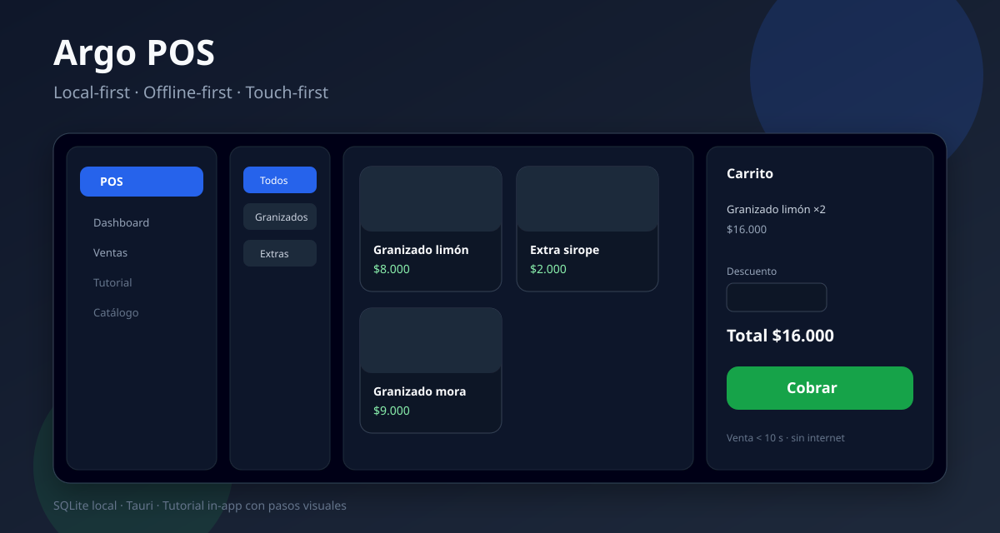
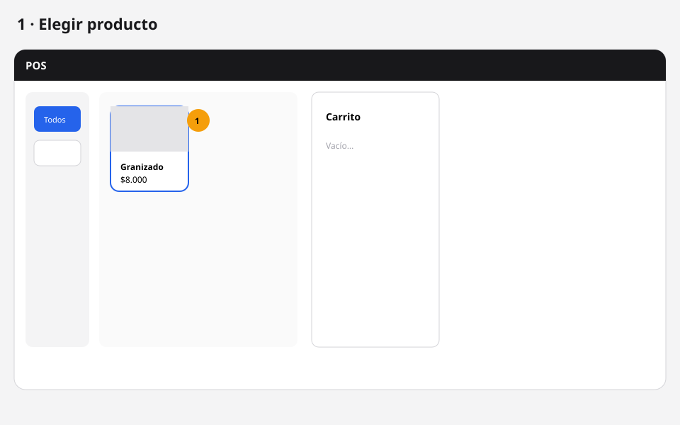
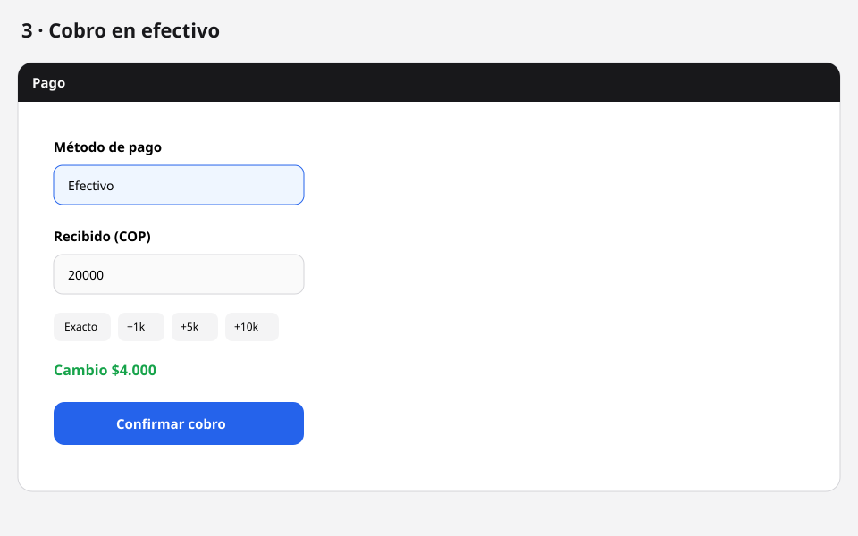
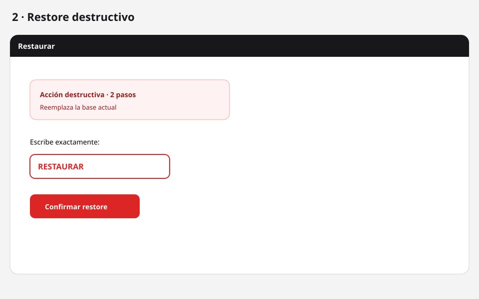

# Argo POS

<p align="center">
  
</p>

POS local-first (Tauri + React + SQLite). Offline-first. Touch-first.

<p align="center">
  
  
  
</p>

<p align="center"><sub>Tutorial in-app con pasos visuales offline (SVG; también admite GIF/PNG).</sub></p>

Documentación de producto:

- [ARCHITECTURE.md](./ARCHITECTURE.md)
- [TASK.md](./TASK.md)
- [MANUAL.md](./MANUAL.md)
- [GIT-FLOW.md](./GIT-FLOW.md)

## Requisitos

- Node.js ≥ 20 (LTS recomendado)
- pnpm 9
- Rust stable vía [rustup](https://rustup.rs/) (`rustc`, `cargo`)
- macOS: Xcode Command Line Tools

El toolchain de Rust vive en tu usuario (`~/.cargo`). El proyecto fija la canal con `rust-toolchain.toml`.

## Arranque

```bash
pnpm install
pnpm tauri:dev
```

La base SQLite (`argo-pos.db`) se crea sola en el directorio de datos de la app:

- macOS: `~/Library/Application Support/com.argo.pos/`
- Windows: `%APPDATA%\com.argo.pos\` (AppData Roaming)

Backups: subcarpeta `backups/` dentro de ese mismo directorio. Imágenes de productos: subcarpeta `images/`. Nunca se escribe la DB junto al `.exe`.

Migraciones corren al iniciar.

## Empaquetado

```bash
pnpm tauri:build
```

- En macOS genera `.app` (validación local del bundle). El `.dmg` es opcional y puede fallar en entornos headless.
- El instalador Windows (NSIS/MSI) se genera en CI: workflow `.github/workflows/build-windows.yml` (`workflow_dispatch` o tag `v*`).

### Probar en Windows (recomendado)

**Opción A — Descargar instalador desde GitHub Actions**

1. Abre [Actions del repo](https://github.com/sacamargo/argo-pos/actions/workflows/build-windows.yml).
2. Entra al run del tag más reciente en verde (p. ej. `v0.1.5`).
3. Al final, descarga el artifact `argo-pos-windows` (zip con `.exe` NSIS y/o `.msi`).
4. En el portátil Windows: descomprime → ejecuta el instalador NSIS (`Argo POS_…_x64-setup.exe`).
5. Abre **Argo POS** desde el menú Inicio.

**Opción B — Compilar en el propio Windows** (si el artifact aún no está listo)

Requisitos: Node 20, pnpm 9, Rust stable ([rustup](https://rustup.rs/)), [Visual Studio Build Tools](https://visualstudio.microsoft.com/visual-cpp-build-tools/) con workload “Desktop development with C++”, WebView2 Runtime.

```powershell
git clone https://github.com/sacamargo/argo-pos.git
cd argo-pos
git checkout v0.1.5
pnpm install
pnpm tauri:build
```

Instalador generado en:

`src-tauri\target\release\bundle\nsis\`

## Checklist de release (QA-010)

Credenciales seed (primer arranque):

- admin / `admin123`
- vendedor / `vendedor123`

Datos locales (no van junto al `.exe`):

`%APPDATA%\com.argo.pos\` → `argo-pos.db`, `backups\`, `images\`

1. Instalar en el PC Windows (artifact CI o build local).
2. **Sin internet** (modo avión): login admin.
3. Catálogo: categoría → producto (opcional: imagen) → inventario con stock.
4. Abrir caja → POS: vender en efectivo con cambio (&lt; 10 s de interacción).
5. Historial → anular venta (revisar que el stock vuelva).
6. Backup manual → restaurar (frase `RESTAURAR`) → cerrar y reabrir app: datos OK.
7. Cerrar sesión → login `vendedor` / `vendedor123`: solo POS + historial/dashboard reducido; sin catálogo/inventario/usuarios/backups.
8. Reinicio forzado (cerrar app a la fuerza) y reabrir: DB intacta.

Precios se guardan en **centavos enteros** (`price_cents`) para evitar errores de redondeo.

Seed inicial (solo primer arranque / seed core):

- admin / `admin123`
- vendedor / `vendedor123`
- métodos de pago, motivos de inventario, settings
- Catálogo, inventario y categorías **vacíos** al instalar (sin demos de negocio)

| Script | Uso |
|--------|-----|
| `pnpm dev` | Solo frontend Vite (sin ventana nativa / sin SQLite) |
| `pnpm tauri:dev` | App desktop en desarrollo |
| `pnpm tauri:build` | Empaquetado nativo |
| `pnpm typecheck` | TypeScript estricto |
| `pnpm lint` | ESLint |
| `pnpm format` | Prettier |
| `pnpm db:generate` | Generar migraciones Drizzle desde el schema |
| `pnpm test` | Vitest (unitarios) |

## Estructura

Ver árbol en `ARCHITECTURE.md` (`src/app`, `modules`, `domain`, `infrastructure`, `database`, etc.).

El prototipo web histórico (Next.js + Supabase) está en la rama `feature/system-pos-web`.
